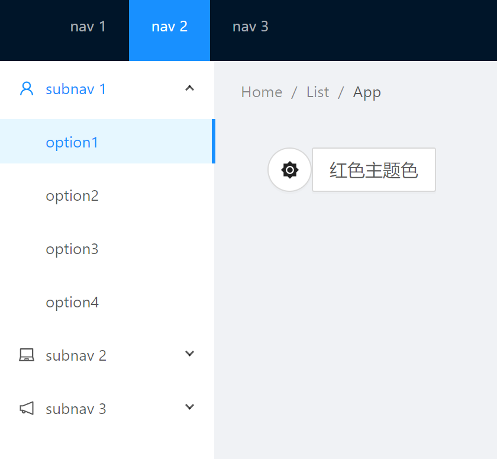
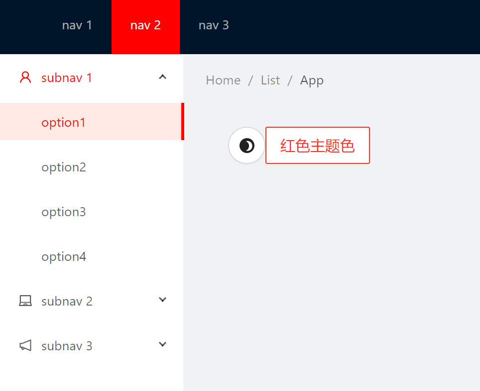
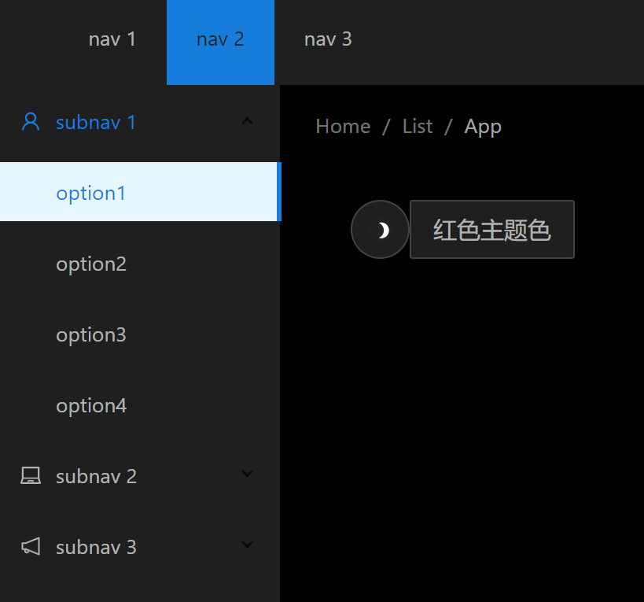

# next-dynamic-antd-theme

[](https://gitee.com/OhYee/next-dynamic-antd-theme) [](https://gitee.com/OhYee/next-dynamic-antd-theme) [](https://gitee.com/OhYee/next-dynamic-antd-theme)
[](https://github.com/OhYee/next-dynamic-antd-theme/tags) [](./LICENSE)

[](https://www.npmjs.com/package/next-dynamic-antd-theme)

[demo](https://ohyee.github.io/next-dynamic-antd-theme/)

Using [antd-theme-generator](https://github.com/mzohaibqc/antd-theme-generator) to change Ant Design theme dynamic for Next.js

It will only import `color.less` and `less.js` after calling `changeTheme`.

## Usage

```
npm i next-dynamic-antd-theme

yarn add next-dynamic-antd-theme
```

See [example](example)

[next.config.js](example/next.config.js)

```js
const generateTheme = require('next-dynamic-antd-theme/plugin');

const withAntdTheme = generateTheme({
  antDir: path.join(__dirname, './node_modules/antd'),
  stylesDir: path.join(__dirname, './theme'),
  varFile: path.join(__dirname, './theme/vars.less'),
  outputFilePath: path.join(__dirname, './.next/static/color.less'), // where to output color.less
  // lessFilePath: // default is `${prefix}_next/static/color.less`, color.less path in broswer
  // lessJSPath: // default is 'https://cdnjs.cloudflare.com/ajax/libs/less.js/3.11.3/less.min.js', less.js path
});

module.exports = withPlugins([withAntdTheme /* ... */], {
  // xxx
});
```

where you want to change theme

```js
import changeTheme from 'next-dynamic-antd-theme';

changeTheme({ '@primary-color': '#ff0000' }); // primary-color as red
changeTheme('default'); // Ant Design default theme
changeTheme('dark'); // Ant Design Dark theme
```

## Screenshot





## License

[MIT](LICENSE)
